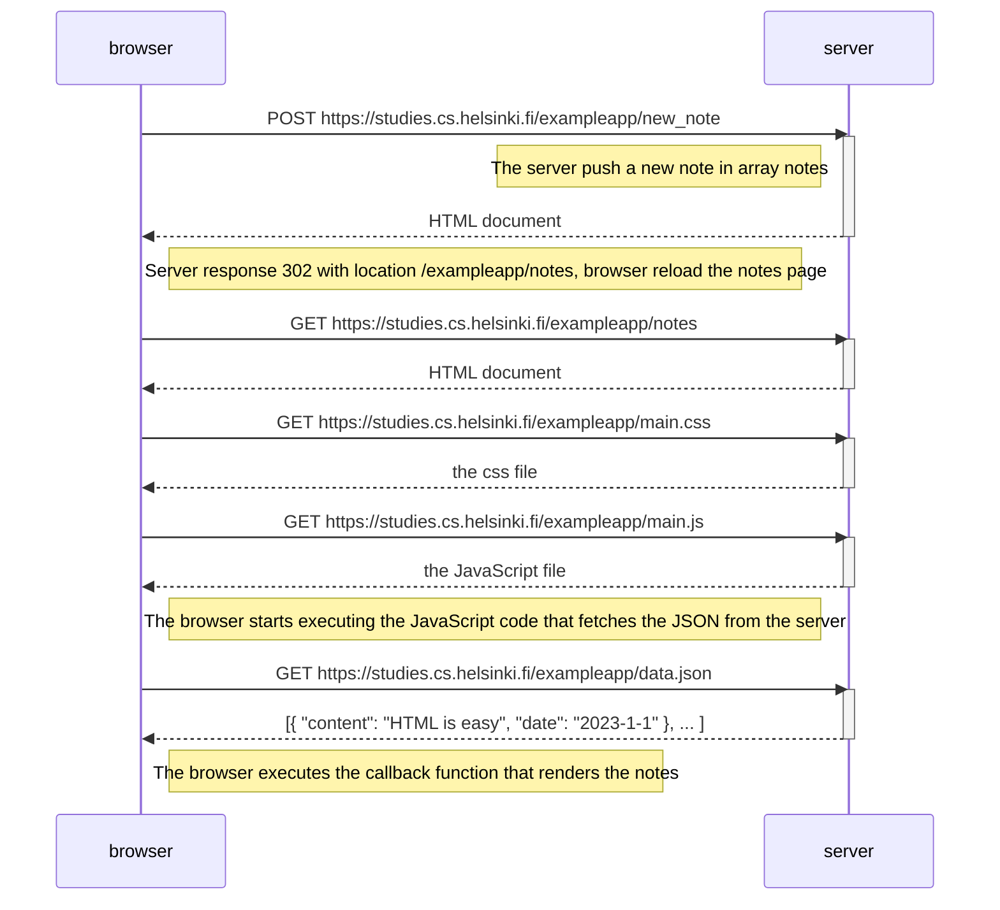
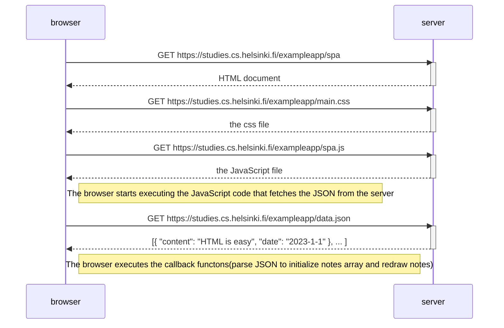
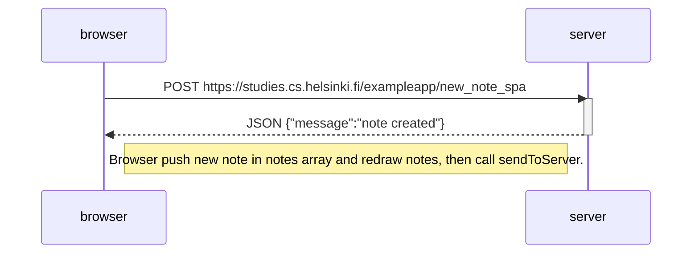

#### 0.4

response from POST contains HTML document(same as the 2nd)?

#### 0.5

#### 0.6

According to JavaScript code, Browser add the new note in notes array and call redrawNotes to update html document, then call sendToServer to send the new note in json format, bacause POST set the position '/exampleapp/new_note_spa', so server can correctly proceed this request.